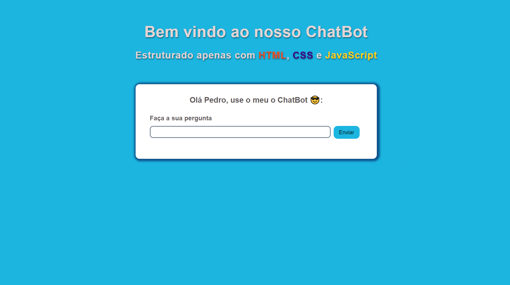
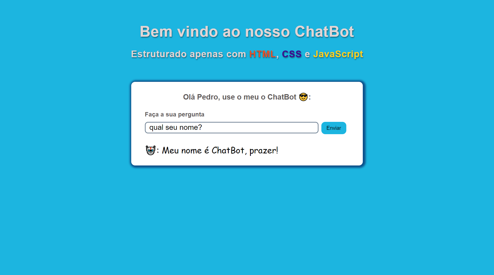

## 👨‍🏫Projeto
**Tudo sobre o ChatBot** é um site criado com propósito de estabelecer uma conexão entre o usuário e o Bot, onde perguntas são feitas pelo usuário e o Bot responde de uma forma funcional.
<br />
<br />

<br />
<br />


**Projeto funcionando** inicialmente, você pode perguntar para o Bot coisas como: "Qual seu nome?", "Quantos anos você tem?", "Você sabe meu nome?", entre outros e ele responderá conforme o padrão de perguntas.

<br />
<br />

<br />
<br />

## 👨🏻‍💻Tecnologias usadas
Este projeto foi desenvolvido utilizando as seguintes tecnologias:
  * HTML5
  * CSS3
  * JavaScript

## ▶️Como rodar
  
 ### **Passo a passo para rodar a aplicação**  
1. Faça o clone do repositório :

```sh
  $ git clone https://github.com/pedrinw/ChatBot.git
```

**Criado com intuito de testar e melhorar meus conhecimento em HTML5, CSS3 e JavaScript**


<h4 align="center">
    👨🏻‍🚀 Feito por Pedro Henrique
</h4>
